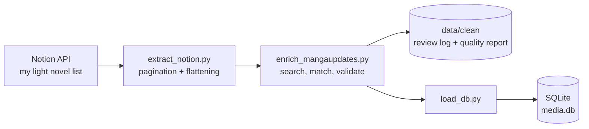

# Light Novel Analytics Pipeline

A Python pipeline that pulls my personal light novel list from **Notion**, enriches it with public data from **MangaUpdates**, checks the quality of every match, and stores the result in **SQLite** for analysis and reporting.

I read a lot of Chinese web novels and track them in Notion with a rating and a status. This project turns that list into a clean, queryable dataset, and answers questions like *what makes me finish a novel instead of dropping it?*

> **Status:** the data pipeline (extraction, enrichment, validation, storage, tests) is working. SQL analysis, a Power BI dashboard and automation are next. See the [Roadmap](#roadmap).

---

## How it works



1. **Extract:** reads every row from a Notion database (handling pagination) and flattens Notion's nested JSON into a simple table. 
2. **Enrich:** searches MangaUpdates for each title and, for safe matches, adds genres, authors, year and public rating. Every API response is cached on disk, so reruns are fast and polite to the API.
3. **Validate:** checks each Notion row (missing title, unexpected status or rating, duplicates) and classifies every match. Anything uncertain goes into a **review log** instead of being guessed.
4. **Store:** loads the result into SQLite. The load rebuilds the tables each time, so running it twice never creates duplicates.
5. **Test:** 12 `pytest` tests check the matching and validation rules using fake data (no internet needed).

---

## Data quality results

The list has **175 rows**. Matching them against MangaUpdates gave:

| Match status | Rows | Share | Meaning |
|---|---|---|---|
| `NOVEL_OK` | 64 | 37% | Found as a novel, similarity score of 90 or more. Enriched automatically. |
| `NOVEL_REVIEW` | 16 | 9% | A similar title (score 70 to 89). **Not** enriched, flagged for a human check. |
| `ADAPTATION_ONLY` | 6 | 3% | Only a manhua or manga version exists. Genres kept, nothing else. |
| `NO_MATCH` | 85 | 49% | Not found. Mostly niche novels that MangaUpdates does not index. |
| `DUPLICATE` | 4 | 2% | The same title entered twice in Notion. Excluded from the database. |

Resulting coverage: **40% of rows have genres** and **25% have a public rating** (many novels have no votes, so a rating of 0 or empty is treated as missing).

The full list of uncertain rows and the reason for each is in [`data/clean/review_log.csv`](data/clean/review_log.csv). Overall numbers are in [`data/clean/quality_report.txt`](data/clean/quality_report.txt).

### Lessons from the matching

My first attempt used a loose similarity score and no type filter. Two problems showed up straight away:

- **A false positive:** The novel "Power and Wealth" matched with a 1994 manga called "Power" with a score of 90, because the scorer rewarded one title being contained in the other.
- **Wrong format:** the search ranks manhua and manga above novels, so many correct series came back as their manhua adaptation instead of the novel.

Fixes:

- Filter results to the **Novel** type, and keep adaptation matches in a separate `ADAPTATION_ONLY` category.
- Use a **strict** similarity scorer instead of a partial-match one.
- Normalise titles first (remove "LN", "(Novel)", punctuation).
- Never auto-accept a score below 90. Send 70 to 89 to the review log.
- Do **not** copy a manhua's rating or authors onto the novel.

Each of these rules has a test in [`tests/test_cleaning.py`](tests/test_cleaning.py).

---

## The data

My Notion list has four columns that matter: title, a rating tier, a reading status and a chapter count.

- **Rating** is an ordered scale of four tiers, mapped to numbers: `TRASH` = 1, `MID` = 2, `TOP TIER` = 3, `GOD TIER` = 4. It is an *ordinal* scale, so the order matters but the gaps between tiers are not equal.
- **Status** is one of `Done`, `Dropped`, `Forgot about it`, `In progress`. Of 175 rows, 34 are Done (about 19%) and 140 are Dropped or Forgot about it.

### Main columns in the enriched table

| Column | Source | Description |
|---|---|---|
| `notion_id`, `title` | Notion | Row id and title |
| `rating`, `rating_score` | Notion | Rating tier and its number (1 to 4) |
| `status`, `chapters` | Notion | Reading status and chapter count |
| `match_status`, `match_score` | Pipeline | Match category and similarity score |
| `mu_series_id`, `mu_title`, `mu_type` | MangaUpdates | The matched series |
| `genres`, `authors`, `mu_year` | MangaUpdates | Extra info (trusted matches only) |
| `public_rating`, `rating_votes` | MangaUpdates | Community rating (empty if 0 or missing) |

### Database tables

- `items`: one row per light novel in my list.
- `series_details`: MangaUpdates info for trusted matches only. Linked to `items` through `mu_series_id`.

---

## Limitations

- **Coverage is partial.** About half of the list is not found in MangaUpdates, so genre and public rating analysis only covers the matched titles. Those are probably the more popular novels, so results may be biased towards well-known titles.
- **Small dataset.** 175 rows is too few for strong statistical claims. Any model or comparison needs to be treated as exploratory.
- **No scraping.** Sites like webnovel.com and Novel Updates have no public API, and scraping them would break their terms, so they are not used.
- **Ratings are not comparable directly.** My four tiers and MangaUpdates' 0 to 10 scale cannot be subtracted. Comparisons will use ranks or percentiles.
- **Manual fixes** can be added in `data/overrides.csv` (columns: `notion_title`, `series_id`) for titles the automatic matching gets wrong.

---

## Run it yourself

Tested on Python 3.12 (Windows).

```bash
git clone https://github.com/<your-username>/notion-media-analytics.git
cd notion-media-analytics
python -m venv .venv
.venv\Scripts\activate          # on Mac/Linux: source .venv/bin/activate
pip install -r requirements.txt
```

1. In Notion, create a connection (API token) and share your database with it.
2. Copy `.env.example` to `.env` and fill in your values:
   ```
   NOTION_TOKEN=your_token
   NOTION_LN_DATABASE_ID=your_database_id
   ```
3. Run the steps in order:
   ```bash
   python src/extract_notion.py
   python src/enrich_mangaupdates.py
   python src/load_db.py
   pytest
   ```

The first enrichment run takes a few minutes (one request per second). Later runs use the local cache.

**Your database needs columns named** `Title`, `Rating`, `Status`, `Chapters` and `URL`. Edit `flatten_page()` in `src/extract_notion.py` if yours differ.

---

## Project structure

```
src/
  extract_notion.py        Notion -> CSV (pagination, flattening)
  enrich_mangaupdates.py   matching, validation, enrichment, review log
  load_db.py               CSV -> SQLite
  explore_mangaupdates.py  exploration script used to design the matching rules
  check_connection.py      quick test that the Notion connection works
tests/
  test_cleaning.py         12 tests for matching and validation rules
data/
  clean/                   review log and quality report (committed)
  raw/                     private data, cache (git-ignored)
```

Private files (`.env`, raw Notion exports, the cache and the database) are excluded through `.gitignore`.

---

## Roadmap

- [ ] SQL analysis: finish rate by rating tier, genre and length
- [ ] Power BI dashboard
- [ ] One command that runs the whole pipeline
- [ ] Scheduled runs with GitHub Actions
- [ ] Exploratory model for which novels I am likely to drop (with honest evaluation on a small dataset)
- [ ] Text-to-SQL assistant with read-only access and query logging

---

## Tech

Python, pandas, requests, rapidfuzz, SQLite, pytest, Notion API, MangaUpdates API, Git.
